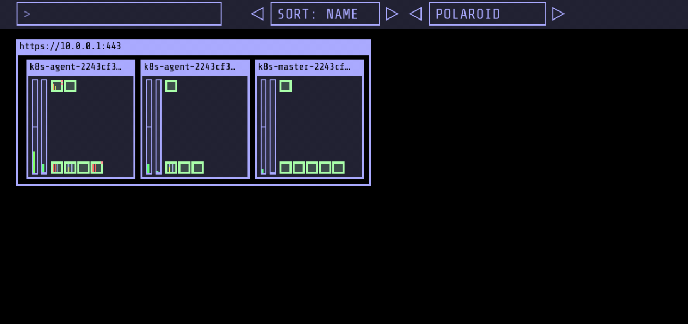

# Deployments and Jobs on Kubernetes

These are the steps for Deployments and Jobs on Kubernetes, including sample YAML files.

## Using Deployments

This method is recommended for containers that must remain online

```
apiVersion: extensions/v1beta1
kind: Deployment
metadata:
  name: queueconsumer
spec:
  replicas: 1
  template:
    metadata:
      labels:
        app: queueconsumer
    spec:
      containers:
      - name: queueconsumer
        image: pocxpto.azurecr.io/app/queueconsumer
      imagePullSecrets:
      - name: pocxptosecret
```

### Important Notes:
* apiVersion: api for Deployment
* replicas: number of required pods. You can increase/decrease through kubectl command or via Dashboard
* app: name of the Deployment
* name: name of the container
* image: use this parameter to inform the entire name of the image located at Azure Container Registry (or any other Registry)
* imagePullSecrets/name: name of the secret (could be obtained using the command *kubectl get secrets*)

More information about Kubernetes Deployments [here](https://kubernetes.io/docs/concepts/workloads/controllers/deployment/)


## Using Jobs

This method is recommended for containers that you want to be offline after the execution

```
apiVersion: batch/v1
kind: Job
metadata:
  name: queueconsumer
spec:
  template:
    metadata:
      name: queueconsumer
    spec:
      containers:
      - name: queueconsumer
        image: pocxpto.azurecr.io/app/queueconsumer
      imagePullSecrets:
      - name: pocxptosecret
      restartPolicy: Never
```
### Important Notes:
* apiVersion: api for Jobs
* name: name of the container
* image: use this parameter to inform the entire name of the image located at Azure Container Registry (or any other Registry)
* imagePullSecrets/name: name of the secret (could be obtained using the command *kubectl get secrets*)
* restartPolicy: must be never

More information about Kubernetes Jobs [here](https://kubernetes.io/docs/concepts/workloads/controllers/jobs-run-to-completion/)


## Monitoring Jobs and Deployments

There is a lot of ways to monitor Kubernetes and we suggest 2 easy ways:

1) Using Kube Ops View



To deploy Kube-Ops-View you will need HELM installed. If you want to deploy just follow the instructions bellow:

```
https://github.com/fabioharams/kubernetes
```

2) Using Kubectl

For Deployments
```
watch -n 1 kubectl get pods
```
For Jobs
```
watch -n 1 kubectl get jobs
```

If you decided to use Jobs then you can use check completed jobs:
```
kubectl get pods -a
```


